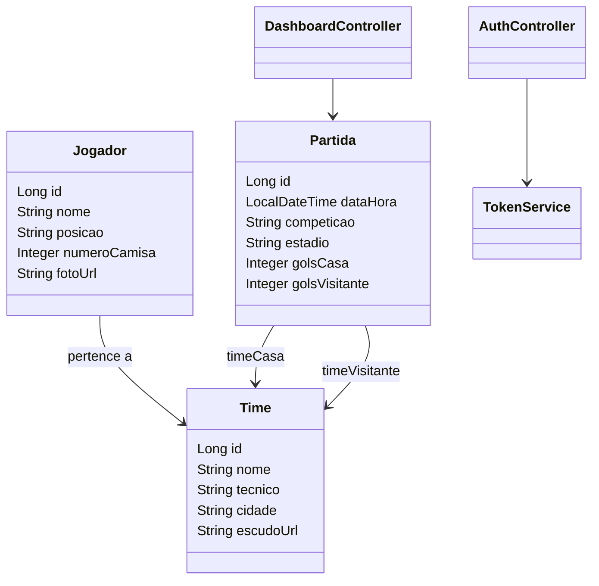
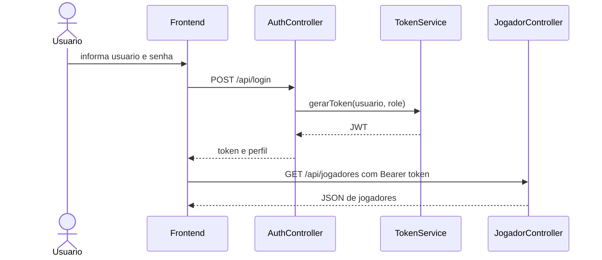
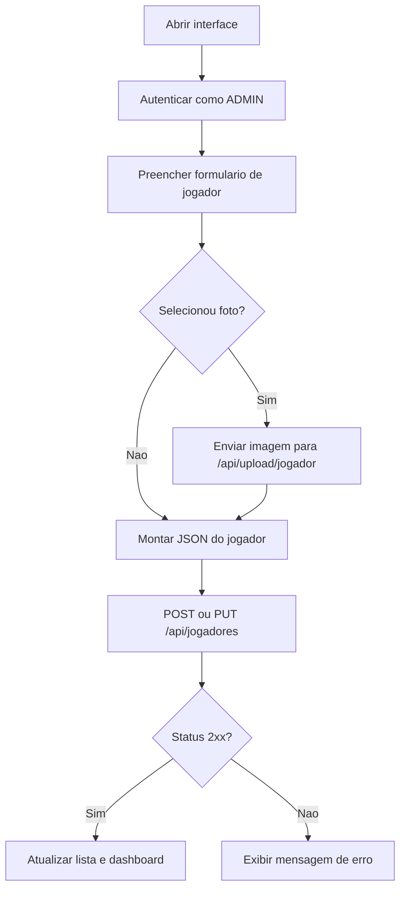

# UML

## Diagrama de Classes

```mermaid
classDiagram
    class Jogador {
        Long id
        String nome
        String posicao
        Integer numeroCamisa
        String fotoUrl
    }
    class Time {
        Long id
        String nome
        String tecnico
        String cidade
        String escudoUrl
    }
    class Partida {
        Long id
        LocalDateTime dataHora
        String competicao
        String estadio
        Integer golsCasa
        Integer golsVisitante
    }
    class AuthController
    class DashboardController
    class TokenService

    Jogador --> Time : pertence a
    Partida --> Time : timeCasa
    Partida --> Time : timeVisitante
    AuthController --> TokenService
    DashboardController --> Partida
```

## Sequencia: Login e Consulta

```mermaid
sequenceDiagram
    actor Usuario
    participant Frontend
    participant AuthController
    participant TokenService
    participant JogadorController

    Usuario->>Frontend: informa usuario e senha
    Frontend->>AuthController: POST /api/login
    AuthController->>TokenService: gerarToken(usuario, role)
    TokenService-->>AuthController: JWT
    AuthController-->>Frontend: token e perfil
    Frontend->>JogadorController: GET /api/jogadores com Bearer token
    JogadorController-->>Frontend: JSON de jogadores
```

## Atividade: Cadastro de Jogador

```mermaid
flowchart TD
    A["Abrir interface"] --> B["Autenticar como ADMIN"]
    B --> C["Preencher formulario de jogador"]
    C --> D{"Selecionou foto?"}
    D -- Sim --> E["Enviar imagem para /api/upload/jogador"]
    D -- Nao --> F["Montar JSON do jogador"]
    E --> F
    F --> G["POST ou PUT /api/jogadores"]
    G --> H{"Status 2xx?"}
    H -- Sim --> I["Atualizar lista e dashboard"]
    H -- Nao --> J["Exibir mensagem de erro"]
```
